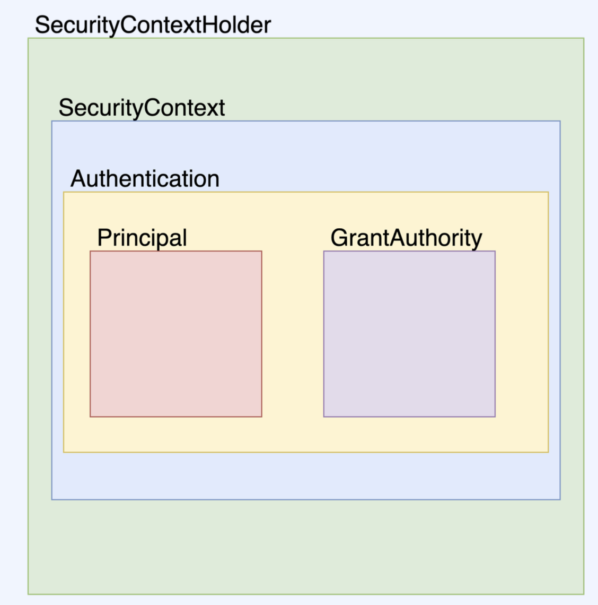

## SpringSecurity의 내부 구조
- code
    ```java
    SecurityContext context = SecurityContextHolder.getContext(); // Security Context  
    Authentication authentication = context.getAuthentication(); // authentication  
    authentication.getPrincipal();  
    authentication.getAuthorities();  
    authentication.getCredentials();  
    authentication.getDetails();  
    authentication.isAuthenticated();
    ```
- 그림
  

- `SecurityContextHolder`
  - `SecurityContext`를 제공하는 static 메소드(`getContext`)를 지원합니다.
- `SecurityContext`
  - `SecurityContext`는 접근 주체와 인증에 대한 정보를 담고 있는 `Context` 입니다.
  - 즉, `Authentication`을 담고 있습니다.
- `Authentication`
  - `Principal`과 `GrantAuthority`를 제공합니다.
  - 인증이 이루어 지면 해당 `Athentication`이 저장됩니다.
- `Principal`
  - 유저에 해당하는 정보입니다.
  - 대부분의 경우 `Principal`로 `UserDetails`를 반환합니다.
- `GrantAuthority`
  - `ROLE_ADMIN`, `ROLE_USER` 등 `Principal`이 가지고 있는 권한을 나타냅니다.  
  - prefix로 `ROLE_`이 붙습니다.  
  - 인증 이후에 인가를 할 때 사용합니다.  
  - 권한은 여러개 일수 있기 때문에 `Collection<GrantedAuthority>`형태로 제공합니다.  
  - ex) `ROLE_DEVELOPER`, `ROLE_ADMIN`